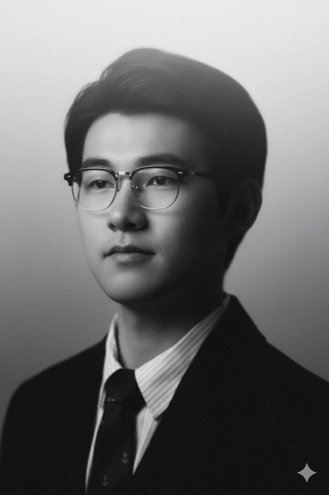
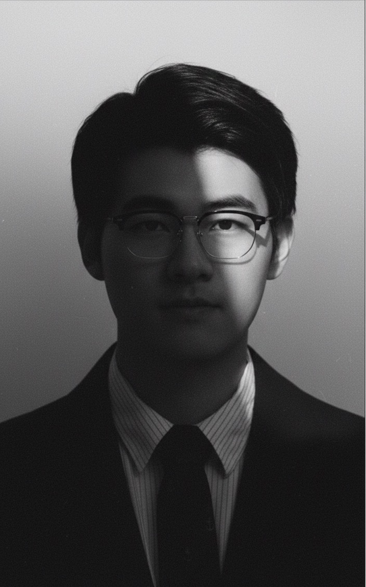
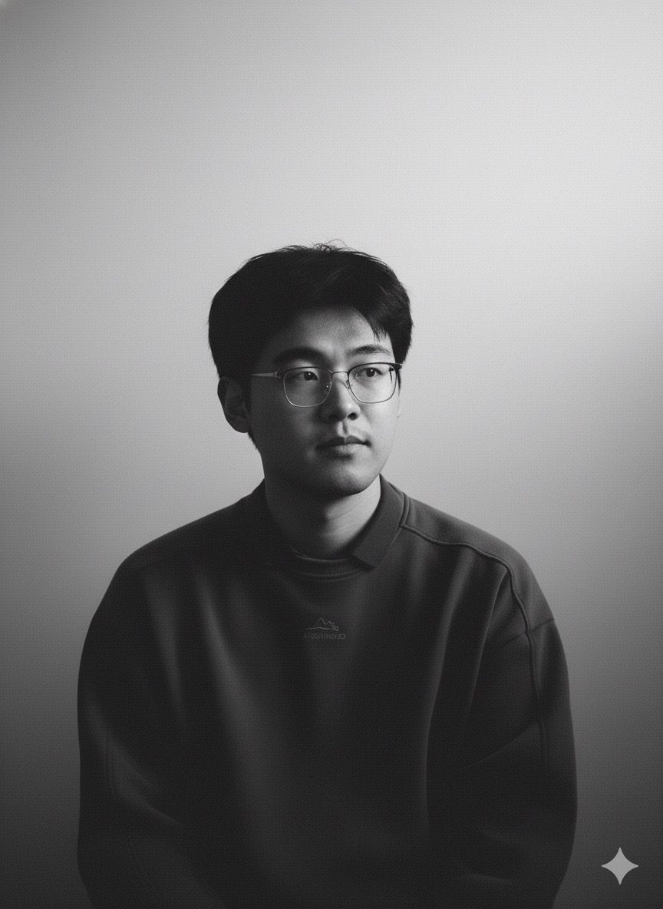

在b站看到了使用Nano banana进行黑白摄影室人像生成的方法，尝试后发现质量颇高，记录如下。

*将上传的照片转换成高分辨率的黑白肖像艺术作品。采用偏纪实类艺术摄影风格。背景呈现柔和渐变效果，从中灰过渡到近乎纯白，营造出层次感与寂静氛围。细腻的胶片颗粒质感为画面增添了一种可触摸的、模拟摄影般的柔和质地，让人联想到经典的黑白摄影。*

*画面中的人物，模糊却惊艳的面容从阴影中隐约浮现，并非传统的摆拍，而像是被捕捉于思索或呼吸之间的瞬间。他的脸部因为光线的轮廓，唤起神秘、亲密与优雅之感。他的五官精致而深刻，散发出忧郁与诗意之美，却不显矫饰。*

*一束温柔的定向光，柔和地漫射开来，轻抚他的面颊曲线，或在眼中闪现光点 —— 这是画面的情感核心。其余部分以大量负空间占据，刻意保持简洁，使画面自由呼吸。画面中没有文字、没有标志 —— 只有光影与情绪交织。*

*整体氛围抽象却深具人性，仿佛一瞥即逝的目光，或半梦半醒间的记忆：亲密、永恒、令人怅然的美。*

---
Prompt中有意使用了大量的形容词来强化一种图片的艺术化风格或者气质，这很符合我先前对大模型感知prompt的刻板印象，即使用大量形容词辅助几个具体的名词主题来抽象地描摹想要的图景，这样得到的结果往往不可控，需要反复来回尝试才能得偿所愿————或者在少数情况下，得到意外之喜。

不过在最近使用gemini的尝试中，我发现VLM的语言理解能力已经快速增强了，幻觉得到了有效的抑制，gemini能够足够精确且保守地生成内容，包括生成正确的中英文以及特定的人数。所以似乎考虑更间接、具体的语义表述也能达到类似效果。

此外，这段prompt的结构也值得学习。从一段技术性的整体画面风格描述开始，接连描述画面主体人物状态以及光源和空白空间的状态，最后更抽象地再次强调整体风格。

生成示例：

