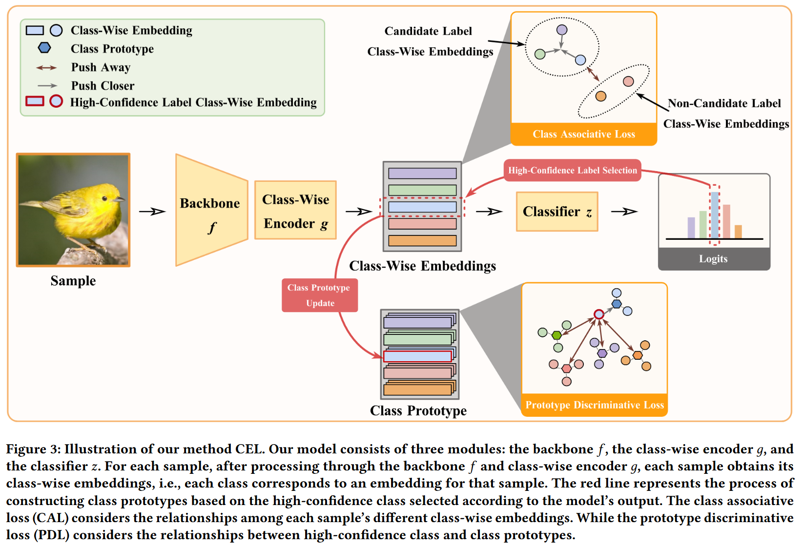

论文：Mixed Blessing: Class-Wise Embedding guided Instance-Dependent Partial Label Learning

## 1 研究问题
- **实例依赖型部分标签学习 (IDPLL) 的挑战：** 在 IDPLL 中，每个样本都关联着一个包含真实标签和若干噪声标签的候选标签集。与传统 PLL（噪声标签随机生成）不同，IDPLL 中的噪声标签与样本特征高度相关（实例依赖），使得它们与真实标签非常相似。
- **双刃剑效应（Mixed Blessing）：** 实例依赖型噪声标签是一把“双刃剑”。
    - **正面：** 噪声标签能在一定程度上描述样本，促进模型在训练早期阶段的收敛和分类性能提升。
    - **负面：** 噪声标签与真实标签的高度相似性带来了更高的标签歧义性，使得识别真实标签更具挑战性，导致模型在训练后期性能下降。
- **目标：** 有效地利用 IDPLL 的特性，同时解决其带来的高标签歧义问题。

## 2 方法
论文提出了名为 **CEL**（Class-Wise Embedding guided Instance-Dependent Partial Label Learning）的新方法。
1. **引入类别感知嵌入 (Class-Wise Embedding)：**
    - 与以往每个样本只有一个嵌入表示的方法不同，CEL 为每个样本引入了多个嵌入，即每个类别对应一个嵌入 (Class-Wise Embedding)。
    - 模型结构由三个模块组成：主干网络 ($f$)、类别感知嵌入编码器 ($g$) 和分类器 ($z$)。
2. **类别关联损失 (Class Associative Loss, $L_{cal}$，利用积极面)：**
    - 旨在利用 IDPLL 的积极面，即候选标签可以描述样本的特性。
    - 通过指导类别感知嵌入的学习来实现：候选标签集内的类别感知嵌入应具有**高相似性**，而候选标签集与非候选标签集之间的嵌入应具有**高差异性**（推开）。
3. **原型判别损失 (Prototype Discriminative Loss, $L_{pdl}$，减轻消极面)：**
    - 旨在减轻高标签歧义的负面影响，帮助模型从候选集中识别真实标签。
    - 引入包含全局特征信息的**类别原型**（Class Prototypes）来指导标签消歧。
    - 通过选取模型输出中最高置信度的候选标签，确保其对应的类别感知嵌入与相应的类别原型对齐（拉近），同时与其他类别原型拉远（推开）。
4. **两阶段训练策略：**
    - **第一阶段（早期）：** 使用分类损失 ($L_{cls}$) 和类别关联损失 ($L_{cal}$)（$L_{all} = L_{cls} + \alpha L_{cal}$），目标是学习更适合 IDPLL 的模型表示。
    - **第二阶段（后期）：** 加入原型判别损失 ($L_{pdl}$)（$L_{all} = L_{cls} + \alpha L_{cal} + \beta L_{pdl}$），进一步提高模型的消歧性能。

## 3 创新点
- **首次引入类别感知嵌入 (Class-Wise Embedding)：** CEL 是第一个在 IDPLL 中引入类别感知嵌入的方法。这使得模型能够探索每个样本中类别关系的细微差别，从而更好地应对 IDPLL 的“双刃剑”问题。
- **全面利用 IDPLL 的双重特性：** 综合考虑了 IDPLL 的正面（通过 CAL 利用标签间的关联性）和负面（通过 PDL 利用全局类别原型来增强判别能力）。

## 4 实验结果
- **性能优越性：** 在六个基准数据集（包括四个易引发标签歧义的细粒度数据集）上，CEL 的分类准确率均优于十二种最先进的 PLL 和 IDPLL 方法。
- **细粒度数据集表现突出：** 在细粒度数据集上，CEL 表现持续卓越，例如在 CUB200 数据集上，相比此前最优方法将分类准确率从 66.60% 提高到 68.60%。
- **显著性测试：** 在所有基准数据集上，根据配对 t 检验（0.05 显著性水平），CEL 显著优于 91.7% (66/72) 的对比方法。
- **学习效率：** 相比其他方法，CEL 在训练早期保持了相对较快的学习速度（归功于 CAL），并在训练后期达到了最高的分类准确率（归功于 PDL）。
- **消融研究：** 类别关联损失 ($L_{cal}$) 平均提高了 1.22% 的准确率，原型判别损失 ($L_{pdl}$) 平均提高了 0.71% 的准确率，证明了这两个核心组件的必要性。

## 5 主要结论
- 论文提出了一种名为 CEL 的新颖方法来解决 IDPLL 问题，并首次认识到 IDPLL 具有积极和消极两方面的“双刃剑”特性。
- 通过构建类别感知嵌入和引入类别关联损失 ($L_{cal}$)，模型能够学习到更适合 IDPLL 的表示，从而利用 IDPLL 的积极面。
- 通过构建原型判别损失 ($L_{pdl}$) 并利用包含全局信息的类别原型来指导消歧过程，有效减轻了 IDPLL 的负面影响。
- 综合实验证明，CEL 显著优于现有方法，且在训练早期收敛更快，在后期获得了最高的分类精度。

