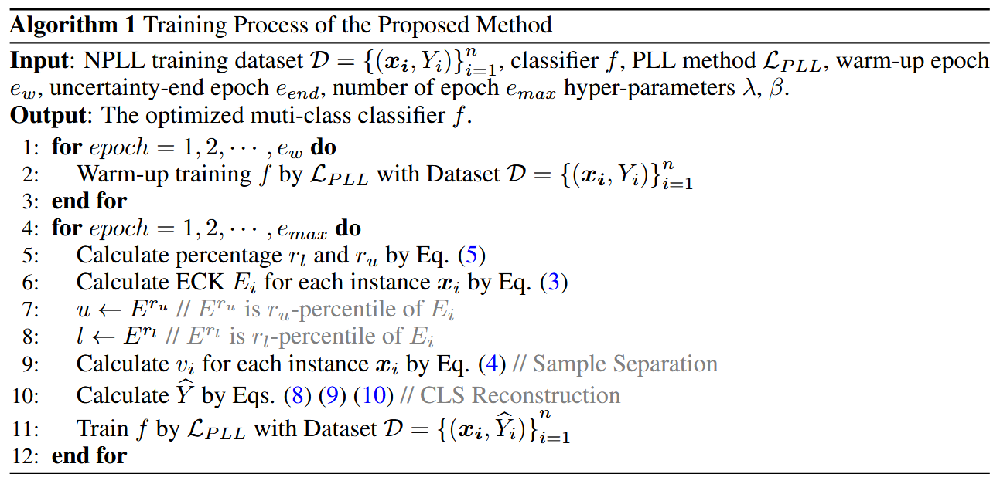

论文：Noise Separation guided Candidate Label Reconstruction for Noisy Partial Label

## 1 研究问题
1. **部分标签学习 (PLL) 的局限性：** 传统的 PLL 是一种弱监督学习范式，它假设每个实例的候选标签集（Candidate Label Set, CLS）中必定包含真实标签。
2. **现实挑战 (NPLL)：** 在实践中，由于非专业标注者等原因，真实标签可能并不总是在 CLS 中，这就引入了**带噪部分标签学习 (NPLL)** 问题。
3. **目标：** 在这种 NPLL 数据集上，训练出一个多分类器 $f(x; \theta)$。

## 2 方法
本文提出的方法通过两个核心组件来降低模型的泛化误差界限：**渐进式样本分离**和**候选标签集重建**。
1. **理论指导：**
    - 首次理论上构建了 NPLL 范式下的分类器泛化误差界限。
    - 发现解决 NPLL 问题的两个关键因素是：**更低的噪声率 ($\epsilon$)** 和 **更小的候选标签集平均长度 ($\alpha$)**。
2. **渐进式样本分离 (Progressive Sample Separation)：**
    - **度量标准：** 提出了一种名为 **ECK (Consistency Error between CLS-based and KNN-based Pseudo-label)** 的度量标准来区分正常样本（真实标签在 CLS 中）和带噪样本（真实标签不在 CLS 中）。
        - ==**ECK 计算基于 CLS 的伪标签 $\tilde{q}_i$ 和基于 K-近邻 (KNN) 的伪标签 $q_i$ 之间的交叉熵误差 $E_i$。==** 当真实标签包含在 CLS 中时，ECK 值往往较小；反之则较大。
    - **==双阈值==策略：** 采用双阈值 $l$ 和 $u$ 将样本分为三类：**高度可靠正常样本** ($E_i \le l$)、**高度可靠带噪样本** ($E_i > u$) 和**不确定样本** ($l < E_i \le u$)。
    - **==渐进式==分离：** 考虑到训练早期模型输出可能不可靠，该方法逐步调整 $l$ 和 $u$，随着模型性能的提高，逐渐增加可靠样本的比例，并减少不确定样本的比例，从而实现更清晰的样本分离。
3. **候选标签集重建 (CLS Reconstruction)：**
    - **目标：** 在降低 CLS 大小的同时，确保真实标签包含在重建的 CLS $\hat{Y}_i$ 中。
    - **优化：** 通过公式化优化问题，平衡最小化 $| \hat{Y}_i |$ 和最小化 $- \langle q_i, S(\hat{Y}_i) \rangle$（利用 KNN 伪标签选择更可靠标签），使用实例自适应参数 $\beta_i = \frac{\beta}{max(q_i​)}$ 来平衡这两个目标。
        - **正常样本 ($v_i=1$)：** $\hat{Y}_i$ 是原 $Y_i$ 中，KNN 伪标签概率 $q_{ij}$ 高于阈值 $\frac{1}{\beta_i}$ 的标签子集。
        - **带噪样本 ($v_i=-1$)：** $\hat{Y}_i$ 是非 CLS ($\mathbb{Y} - Y_i$) 中，KNN 伪标签概率 $q_{ij}$ 高于阈值 $\frac{1}{\beta_i}$ 的标签子集。
        - **不确定样本 ($v_i=0$)：** 在训练早期，为避免收敛速度减慢，将非 CLS 中伪标签概率最高的标签加入 CLS，并将 CLS 中伪标签概率最低的标签移除。
4. **迭代提升：** 模型利用重建后的 CLS $\hat{Y}_i$ 进行优化训练。随着模型性能的提升，它反过来增强了样本分离和 CLS 重建的效果，最终在 NPLL 数据集上实现卓越性能。该方法可作为现有 PLL 方法的即插即用（plug-in）组件。

## 3 创新点
1. **首次理论化 NPLL 泛化误差：** 首次提供了 NPLL 范式下分类器的泛化误差界限，并指出降低噪声率 ($\epsilon$) 和 CLS 平均大小 ($\alpha$) 是解决 NPLL 问题的关键。
2. **渐进式分离机制：** 提出 ECK 度量和双阈值策略，能够渐进地将样本分离为高度可靠正常样本、高度可靠带噪样本和不确定样本，优于以往方法中简单地将不确定样本直接划分为某一类别的做法。
3. **基于理论指导的 CLS 重建：** 提出了一种 CLS 重建方法，它同时实现纠正带噪标签和减少 CLS 大小的目标，并通过实例自适应参数进行平衡，这是以往方法未曾考虑的。
4. **即插即用兼容性：** 该方法可以作为插件应用于现有任何 PLL 方法，有效提升其在 NPLL 数据集上的性能。

## 4 实验结果
1. **分类准确性 SOTA：** 在 CIFAR10 和 CIFAR100 等多个基准数据集上，本文方法显著优于所有对比的 SOTA 方法。
2. **显著的性能提升：** 在 CIFAR100 数据集上，针对极高噪声和模糊度的设置，本文方法的分类准确性比现有 SOTA 方法提升了 **11.57%**。
3. **兼容性验证：** 作为即插即用组件，本文方法与不同的 PLL 方法（如 PRODEN、CRDPLL 和 PaPi）结合后，性能均得到显著增强，并在所有测试案例中优于 ALIM 方法。
4. **鲁棒性验证：** 在细粒度数据集（CIFAR100H、CUB200、Flower）和真实世界众包数据集（Treeversity、Benthic）上，本文方法依然保持了卓越的有效性。
5. **组件有效性：** 消融实验证实，所有组成部分（特别是双阈值分离策略和 CLS 重建）都对性能改进有贡献。
6. **泛化误差界限缩小：** 实验结果表明，随着模型训练的进行，泛化误差界限中的关键因子 $1 - \frac{1-\epsilon}{\alpha}$ 持续减小，从而验证了所提方法能够缩小泛化误差界限。

## 5 主要结论 
本文提出了一种新颖的 NPLL 框架，该框架基于理论分析，专注于降低噪声率和减小候选标签集平均长度这两个关键因素。通过**渐进式样本分离**和**实例自适应的 CLS 重建**，该方法能够有效地提升现有 PLL 方法在带噪数据集上的性能，并在广泛的实验中实现了显著优越的分类准确性。
